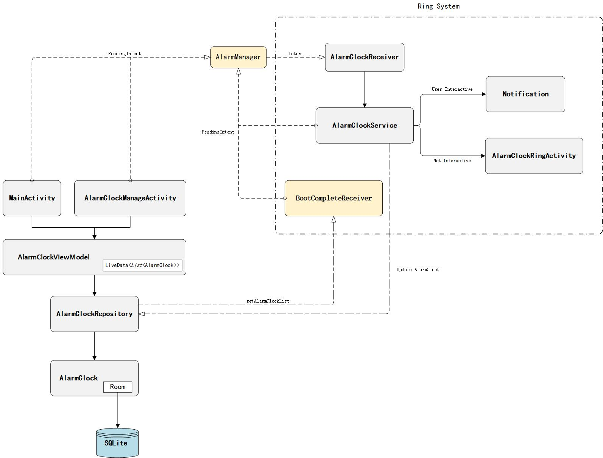

# 小V提醒

2021年10月18日20:44:17
## 求助  这个代码被我改坏了，现在用不了 (用粗暴的方式暂时解决了)
救命 迁移之后 app闪退，一个错误都不报，怎么办，不知道是不是迁移的语句写错了。因为我是add column的，
但是我写成了 创建一个新表然后复制旧表了。但是后来改回来之后还是这样，还是闪退，但是一个错误都不报。
logcat和 run 界面什么都没有。 但是adb看了数据库的建表语句还是最开始的啊，之前的那个应该没有迁移成功吧，
现在把MIGRATION_1_2 里面的语句改掉应该可以的吧。。。
具体就是
在这里新建了
https://gitee.com/starplatinum111/alarm-clock/blob/master/app/src/main/java/cn/chenjianlink/android/alarmclock/model/AlarmClock.java
`private boolean stopOnce;`

https://gitee.com/starplatinum111/alarm-clock/blob/master/app/src/main/java/cn/chenjianlink/android/alarmclock/db/BaseAlarmClockDatabase.java
这个代码是数据迁移
这是 adb 获得的建表语句(获得的方法是 https://blog.csdn.net/jonathan_joestar/article/details/120817023 )
```roomsql
CREATE TABLE `clock_table` (`clock_id` INTEGER PRIMARY KEY AUTOINCREMENT NOT NULL, `hour` INTEGER NOT NULL, `minute` INTEGER NOT NULL, `ringCycle` INTEGER NOT NULL, `isStarted` INTEGER NOT NULL, `remark` TEXT, `ringMusicUri` TEXT, `isVibrated` INTEGER NOT NULL)
```
根据这篇文章，我就直接不迁移数据库了，直接把之前的数据毁掉，就可以顺利启动了，但是我还是不会迁移
https://blog.csdn.net/u013762572/article/details/106315045
    .fallbackToDestructiveMigration()

2021年10月18日22:02:03
回到桌面之后确实也会提醒的，不过我是在一分钟内测试的，不一定准，如果一小时以上，还能活着吗

This version of the Android Support plugin for IntelliJ IDEA (or Android Studio) cannot open this project,
please retry with version 4.1 or newer.


2021年10月17日12:53:17
文档：wOrHideHighlightView hasFocus=false;...
链接：http://note.youdao.com/noteshare?id=c99faf09f02f5078fa4d7c06ac76075e&sub=2D890A4D39A24613892B97EFBB53FA38

没有铃声
不是蓝牙耳机的原因，耳机摘掉了还是没有声音
这个闹钟是要手机铃声开启 不是媒体音量

2022年2月8日17:20:25
信息的接收service 是会destroy的，所以在destroy 的时候尝试重新开启这个服务吧，能不能变得流氓呢

2022年2月8日20:08:03
文档：小v 提醒.note
链接：http://note.youdao.com/noteshare?id=a5badc5e1baef077f056a865eb024268

2022年2月10日12:18:35
EmailSendThread
这里的password 要删掉
监听信息做成前台服务，可以保持一天，但是睡了一晚上 第二天又是不行了
上传的版本
G:\project\Android\AlarmClockPubFront

# 以下原文

作为一名合格的程序员，产品思想不能缺少。通过竞品分析去自主设计这一款闹钟App，确认需求，再进行开发调试

作为一个合格闹钟应用，它应该具有以下几个基本素养：
- 新建闹钟
- 修改闹钟
- 保存闹钟
- 到时提醒（最核心功能）
- 删除闹钟

有了这些基本功能，其他的功能对于闹钟来说是锦上添花

## 系统架构图
除了确定产品需求，还需要架构设计，该应用的架构图如下(对应的[Visio图](README/System_architecture_diagram.vsdx))：

